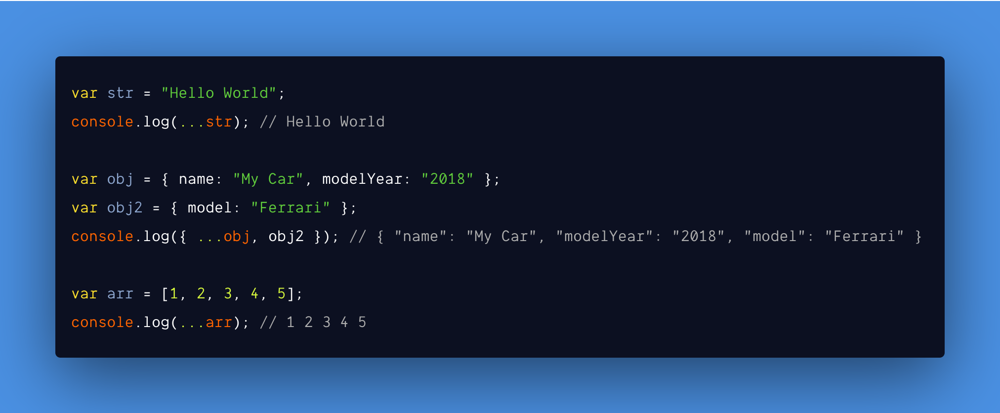

<br /><br />

In javascript [Spread operator](https://developer.mozilla.org/en-US/docs/Web/JavaScript/Reference/Operators/Spread_syntax) denoted by **…** (3 dots), basically takes an array or object or string and can **copy or expand or concat or merge** its items to another variable.

And we will not be looking into [rest parameters](https://developer.mozilla.org/en-US/docs/Web/JavaScript/Reference/Operators/Spread_syntax#Rest_syntax_parameters) which looks similar to spread operator but used for destructing array and objects.

#### Example:

```js
var str = "Hello World";
console.log(...str); // Hello World

var obj = { name: "My Car", modelYear: "2018" };
var obj2 = { model: "Ferrari" };
console.log({ ...obj, obj2 }); // { "name": "My Car", "modelYear": "2018", "model": "Ferrari" }

var arr = [1, 2, 3, 4, 5];
console.log(...arr); // 1 2 3 4 5
```

<p>First we will see its pros and cons and how it works then we will implement it.</p>

Let us start with the cons.

#### Cons:

- It can be used copying but only up to one level deep. So it is not suitable for copying multidimensional arrays.
- It can spread only **enumerable** properties of an Object.
- It can only be applied to [iterable](https://developer.mozilla.org/en-US/docs/Web/JavaScript/Reference/Global_Objects/Symbol/iterator) objects.
- It will work on both **Array** and **Object** data types but you cannot mix and match them.

#### Pros:

- It can be used for shallow cloning an object if we want to copy only that object's own properties.
- Cleaner syntax and less code when merging or copying.
- Can call a function or use a **Math** method without the need for **.apply** method to pass multiple parameters.
- It can be used to convert an array like object into an actual array. (**Eg: NodeList from DOM**)

Now we have an idea of what spread operator is and what it can and can't do. Let's implement it step by step.

#### Step 1:

- We will use [Symbol.iterator](https://developer.mozilla.org/en-US/docs/Web/JavaScript/Reference/Global_Objects/Symbol/iterator) to write our custom spread operator.

**Custom Spread Operator**: For numbers

```js
// This is how our Custom Spread Operator will look like
console.log([...5]); // [1, 2, 3, 4, 5]
```

Before we proceed further, let us see what is **Symbol.iterator** method.

Actually its very simple:

- **Symbol.iterator** let us to create a custom iterator. (Which was not possible before ES6)
- It uses **iterator protocol** which defines a standard way to produce a sequence of values which is either **finite** or **in-finite** and return those values **when all values** are done or generated.
- Iterable data sources are **Array**, **Sets**, **Maps**, **Objects**, **arguments** and **DOM data structures** (Eg: **NodeList**) etc,.

**Symbol.iterator** contains two parts.

1. An object whose key is **Symbol.iterator** called `Iterable`.
1. A function for the above key called `Iterator` to iterate the values passed to it.

**Example**:

```js
var myCustomIterator = {
  [Symbol.iterator]: function() {},
};
```

Simple right? 😆

In the below example, we will create a simple **iterable function** to understand more.

**👉🏻 Note:** By default functions are **not iterable**.

```js
// below is simple function which will accept one parameter called `n`
// and it return an object with Iterable and Iterator function.
var getMyNumbers = function(n) {
  var myCustomIterator = {
    [Symbol.iterator]: function() {
      var i = 0; // Statement 1
      return {
        // Below code is explained at the end of the example
        next: () => {
          return {
            value: i++, // Statement 3
            done: i === n + 2, // Statement 2
          };
        },
      };
    },
  };

  return myCustomIterator;
};

getMyNumbers(); // returns a iterable function
```

Explanation for above code:

1. Above function return an object with Iterable and Iterator function.
1. Returned object has a method called `next()` and it in turn return an **object** with two properties called **value** & **done**.
1. Method `next()` will be called on each iteration.
1. Think of `value` property as **third statement** in for loop (Eg: **for (statement 1; statement 2; i++)**).
1. Think of `done` property as **second statement** in for loop (Eg: **for (statement 1; i === n; i++)**)
1. So we will increment initial value **i** from **0** until **n**.

To make sure our `getMyNumbers()` is iterable we will use **for of** and **spread operator** loop in below example:

```js
for (var i of getMyNumbers(10)) {
  console.log(i); // prints from 1 to 10
}

// It works 😆

// Now we can do this
[...getMyNumbers(10)]; // prints from 1 to 10

// TADA 😁
```

Cool right?

Now we understood how to **make a custom function as iterable** and made our own **custom spread operator** function.

In the final step, we will make **getMyNumbers()** as a default feature so that we can do this `[...10]` instead of `[...getMyNumbers(10)]`.

**Example**:

```js
// Adding Symbol.iterator to Number's prototype
Number.prototype[Symbol.iterator] = function() {
  var i = 1; // Statement 1
  return {
    next: () => {
      return {
        value: i++, // Statement 3
        done: i === this + 2, // Statement 2
      };
    },
  };
};

// Now i can do this too 🤪
console.log([...10]); // [ 1, 2, 3, 4, 5, 6, 7, 8, 9, 10 ]
```

### Final thoughts

Thanks to **ES6** specs, we were able to write our own **custom iterator function** with **spread operator** which was not possible before. Now that we learned how powerful **Symbol.iterator** is so looking forward to know how you are using it.

Hit reply to my newsletter or tweet about it. Hoping we learned something new about javascript today.

My next post is **how virtual DOM works**. If you are not subscribed, subscribe below :D

<hr />

#### References:

- [MDN](https://developer.mozilla.org/en-US/docs/Web/JavaScript/Reference/Operators/Spread_syntax)
- [Spread operator TC39 specification](https://tc39.es/proposal-object-rest-spread/)
- [Iterables and iterators](https://exploringjs.com/es6/ch_iteration.html#ch_iteration)
