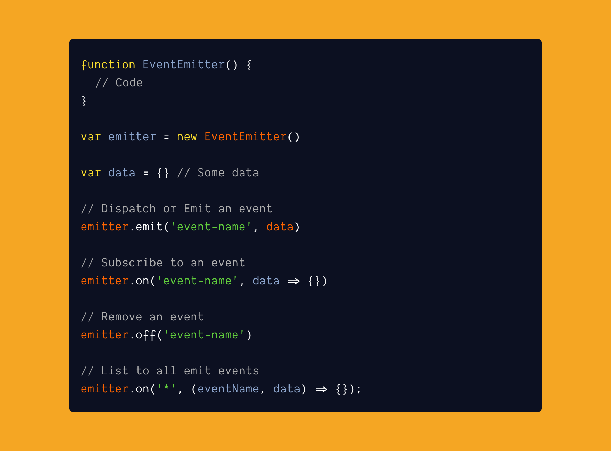

<br /><br />

Event emitters are useful when you want to listen to an event and do something when it happens. An event emitter is also called as `publisher/subscriber` pattern.

Wait, I know this. If you have used `Redux` which uses similar kind of event emitters to **dispatch** an event and **subscribers** can listen to the changes.

### Skeleton Code:

```js
function EventEmitter() {
  // Code
}

var emitter = new EventEmitter();

var data = {}; // Some data

// Dispatch or Emit an event
emitter.emit("event-name", data);

// Subscribe to an event
emitter.on("event-name", data => {});

// Remove an event
emitter.off("event-name");

// List to all emit events
emitter.on("*", (eventName, data) => {});
```

#### Event emitter function consists of:

- An object called `events` to hold all the events.
- `on()` - To listen to an event.
- `emit()` - To emit an event.
- `off()` - To remove an event.

Let's see how each method works in our event emitter.

### on():

**On** method accepts two parameters **name** and a **callback**.

**Pseudo code**:

- If an event name is not present in our events object, then create an event with an empty array.
- An empty array is to hold as many callback functions as it can.

#### Code:

```js
function EventEmitter() {
  const events = {}; // To hold our events

  // On method to listen
  function on(eventName, callback) {
    // If event is not present, create an empty array to hold multiple events
    if (!events[eventName]) {
      events[eventName] = []; // To hold multiple on events
    }

    // Push the callback function to event name so that we can listen as many time as we want.
    events[eventName].push(callback);
  }

  return { on }; // return on method
}
```

### emit():

**Emit** method is to emit events based on the **event name** with/without **data**.

**Pseudo code**:

1. Check if an emitted event is present if so emit it.
2. Check if `*` (all) is present, so involve it (`*` present means user wants to listen to all events)

```js
function EventEmitter() {
  const events = {}; // To hold our events

  // To emit an event with options
  function emit(eventName, options) {
    // Check if event is present in eventName and if so call event with arguments
    if (events[eventName]) {
      // Call events match the name
      events[eventName].forEach(event => event(options));
    }

    // Check if * is present then call all the events with arguments
    if (events["*"]) {
      // Iterate the events object and call each obj
      Object.keys(events).forEach(eventKey => {
        events[eventKey].forEach(event => event(eventName, options)); // Call all the events
      });
    }
  }

  return { emit }; // return emit method
}
```

### off():

As the name suggests we will `Off`/`remove` events & its callback from our events object if present.

**Pseudo code**:

- If the event name is present, then remove the callback for that event name.

```js
function EventEmitter() {
  const events = {}; // To hold our events

  // To listening to an event
  const off = (eventName, callback) => {
    if (events[eventName]) {
      events[eventName] = events[eventName].filter(
        handler => handler !== callback
      );
    }
  };

  return { off }; // Return the event
}
```

### Full code:

```javascript
function EventEmitter() {
  const events = {}; // To hold our events

  // On method to listen
  const on = (eventName, callback) => {
    // If event is not present, create an empty array to hold multiple events
    if (!events[eventName]) {
      events[eventName] = []; // To hold multiple on events
    }

    // Push the callback function to event name so that we can listen as many time as we want.
    events[eventName].push(callback);
  };

  // To emit an event with options
  const emit = (eventName, options) => {
    // Check if event is present in eventName and if so call event with arguments
    if (events[eventName]) {
      // Call events match the name
      events[eventName].forEach(event => event(options));
    }

    // Check if event is all and if so call all the events with arguments
    if (events["*"]) {
      // Iterate the events object and call each obj
      Object.keys(events).forEach(eventKey => {
        events[eventKey].forEach(event => event(eventName, options)); // Call all the events
      });
    }
  };

  // To listening to an event
  const off = (eventName, callback) => {
    if (events[eventName]) {
      events[eventName] = events[eventName].filter(
        handler => handler !== callback
      );
    }
  };

  return { emit, on, off }; // Return the method
}
```

### [Demo](https://codesandbox.io/s/event-emitters-7vc1w?from-embed):

<iframe
 src="https://codesandbox.io/embed/confident-moser-7vc1w?autoresize=1&expanddevtools=1&fontsize=14&hidenavigation=1&theme=dark"
 style="width:100%; height:500px; border:0; border-radius: 4px; overflow:hidden;"
 title="Event Emitters"
 allow="geolocation; microphone; camera; midi; vr; accelerometer; gyroscope; payment; ambient-light-sensor; encrypted-media; usb"
 sandbox="allow-modals allow-forms allow-popups allow-scripts allow-same-origin"
 ></iframe>

### Wrapping up

In this post, we understood how an event emitter works and what could be its implementation. Event emitter is helpful in creating event-based javascript applications.

On a personal note: COVID-19 is spreading rapidly to many countries, please stay home and stay safe and avoid going in groups. These are challenging times, but if we work together we can get through this together too.

My next post is about `redux`. See ya next week.

Thanks for reading it to the end 🥶.
