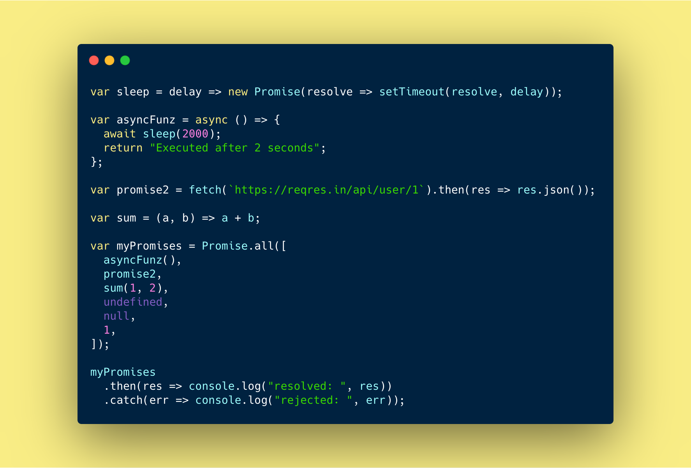

<br /><br />

Let’s say we want many promises to execute in parallel and wait until all of them are resolved. Then [Promise.all](https://developer.mozilla.org/en-US/docs/Web/JavaScript/Reference/Global_Objects/Promise/all) is the right candidate which takes an array of promises and returns a new promise.

<b>Resolves when:</b>

1. Promises which will be fulfilled after sometime (Eg: <b>API which fulfills after 10 seconds</b>)
1. Promises that have been already fulfilled (Eg: <b>API which fulfils before passing to .all()</b>)
1. Non-promises based functions, variables etc, (Eg: <b>Function which returns a value</b>)

<b>Rejects when</b>:

1. If one of promise get rejected, then `Promise.all` immediately rejects, completely ignoring about the other ones on the list.

We are going to see an example of how `Promise.all` works based on above points and then we will implement it.

#### Example:

```javascript
/* A simple sleep function to sleep for certain time and then resolve it */
var sleep = delay => new Promise(resolve => setTimeout(resolve, delay));

// Async function
var asyncFunz = async () => {
  await sleep(2000); // await method will wait for 2 seconds and return below string
  return "Executed after 2 seconds";
};

/* Fetch user information */
var promise2 = fetch(`https://reqres.in/api/user/1`).then(res => res.json());

/* A simple function which add's two numbers and return it */
var sum = (a, b) => a + b;

/* Adding above methods and some more to Promise.all method */
var myPromises = Promise.all([
  asyncFunz(),
  promise2,
  sum(1, 2),
  undefined,
  null,
  1,
]);

/* Attaching .then, .catch methods to handle Promise.all */
myPromises
  .then(res => console.log("resolved: ", res))
  .catch(err => console.log("rejected: ", err));

// Above Promise.all resolves and log the result (Below line for result)
// resolved: ["Executed after 2 seconds", {data: {...}}, 3, undefined, null, 1]
```

In the above example, `asyncFunz`, `promise2` are actual `async functions` and the rest of items in the array are a normal function, undefined, null and 1.

We can understand that `Promise.all` method accepts both `async/promise` and `non-async/non-promise` functions, variables etc,.

#### To to write our custom <b>promise.all()</b> function, we are going follow `3 steps`.

#### Step 1:

- We will create a function called <b>promiseAll</b> which accepts a parameter called `promisesArr`.
- This function will have two variables called <b>result</b> (Type: Array) and <b>counter</b> (Type: Number).
- `result` variable to store the result of each promise.
- `counter` variable to keep the count of how many promises resolved so far.
- Finally, Add `Promise` object to resolve/reject and return it (`More info on step 2`).

```javascript
/* Promise.all() custom function */
function promiseAll(promisesArr) {
  /* To keep the result of resolved promises */
  var result = Array(promisesArr.length);

  /* To keep track of how many promise got resolved */
  var counter = 0;

  /* To resolve when all the promises are resolved else reject even if one promise is rejected */
  return new Promise((resolve, reject) => {});
}
```

#### Step 2:

- Now we will iterate the given <b>promisesArr</b> so that we can resolve them by attaching <b>.then</b> to each iteration.

- We will use `Promise.resolve()` method to handle both `promise` & `non-promise` items. Either it will resolve immediately or wait for each item to `resolve/reject`.

- We will be adding <b>.then</b> and <b>.catch</b> methods to handle once the promise `settles` in each iteration.

```javascript
function promiseAll(promisesArr) {
  /* To keep the result of resolved promises */
  var result = Array(promisesArr.length);

  /* To keep track of how many promise got resolved */
  var counter = 0;

  /* To resolve when all the promises are resolved else reject even if one promise is rejected */
  return new Promise((resolve, reject) => {
    // Iterating the given promises array
    promisesArr.forEach((promise, index) => {
      // To handle both promise & non-promise in each iteration
      Promise.resolve(promise)
        .then(item => {
          // Store the result
        })
        .catch(err => {
          // If there is an error, reject it immediately
        });
    });
  });
}
```

#### Step 3: (Final)

- We will increment the `counter variable` and store the resolved item in `result variable` in the respective order.
- If the `counter length` is same as <b>promisesArr</b> length, then resolve the outer promise else we reject it and return with error.

```javascript
function promiseAll(promisesArr) {
  /* To keep the result of resolved promises */
  var result = Array(promisesArr.length);

  /* To keep track of how many promise got resolved */
  var counter = 0;

  /* To resolve when all the promises are resolved else reject even if one promise is rejected */
  return new Promise((resolve, reject) => {
    // Iterating the given promises array
    promisesArr.forEach((promise, index) => {
      // We need to resolve each item in promises so that even if there is non-promise item we can handle it
      Promise.resolve(promise)
        .then(item => {
          counter += 1; // Update the counter
          result[index] = item; // Store the result in the same order as given

          /* If counter is equal to promises.length then all promises are fulfilled */
          if (counter === promisesArr.length) {
            resolve(result); // All promises resolved so resolve outer promise
          }
        })
        .catch(err => {
          reject(err); // If there is an error, reject the outer promise immediately
        });
    });
  });
}
```

### [Demo](https://codesandbox.io/embed/promiseall-implementation-n9dlu?fontsize=14&hidenavigation=1&theme=dark)

Above piece of code may not be same as how browser vendors would have implemented <b>Promise.all()</b> method, but you get the idea right how it works?.

I hope this post was useful and we all have learned something new. See you in my next post.

My next post will be about how to write `custom spread operator` and how it works. If you are not subscribed, subscribe below :D

<hr />

#### References:

- [MDN](https://developer.mozilla.org/en-US/docs/Web/JavaScript/Reference/Global_Objects/Promise/all)
- [Promise.all() TC39 specfication](https://tc39.es/ecma262/#sec-promise.all)
