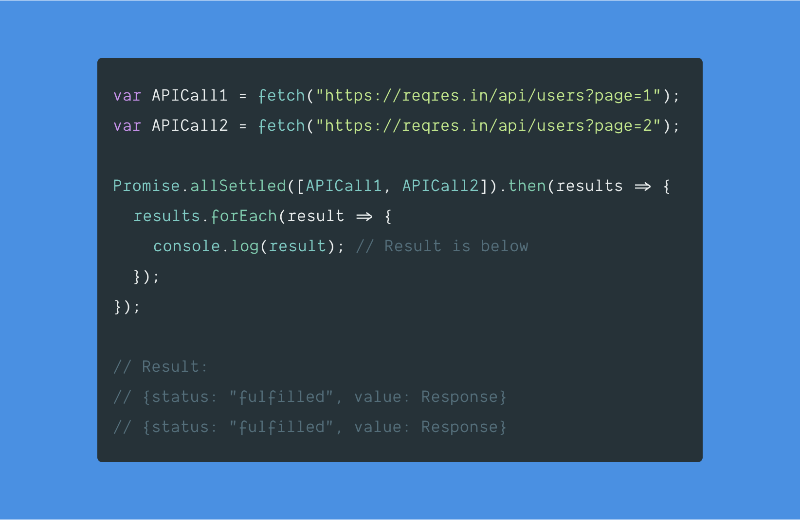

<br /><br />

**Promise.allSettled()** returns a promise when all inputs are `settled` that is either `fulfilled` or `rejected`.

### 👉🏻 Points to remember:

- Returns a promise that contains an **array of results**.
- Each **result object** will have **two properties** (**status** & **reason or value**).
- **status** with value either **fulfilled** or **rejected**.
- **value** if **fulfilled** or a **reason** if **rejected**.

#### Difference between `Promise.all` & `Promise.allSettled`

- `Promise.all` will reject as soon as one of the items in the input is rejected.
- `Promise.allSettled` will never reject and will wait until all inputs are settled.

**Use cases**:

- Make several API's and wait until all of them are settled 🤔.

I am not so sure of many use-cases. But we want to know how it works right. In the below example, we will see how it works first and then we will implement it.

#### Example:

```js
var APICall1 = fetch("https://reqres.in/api/users?page=1");
var APICall2 = fetch("https://reqres.in/api/users?page=2");

Promise.allSettled([APICall1, APICall2]).then(results => {
  results.forEach(result => {
    console.log(result); // Result is below
  });
});

// Log:
// {status: "fulfilled", value: Response}
// {status: "fulfilled", value: Response}
```

Below is a simplified version of **TC39 specs** to understand its implementation details.

[Promise.allSettled()](https://tc39.es/proposal-promise-allSettled/#sec-performpromiseallsettled) specification says

1. Accepts `iterable` object as a argument.
1. If `not iterable`, `throw` an `exception` with an error message.
1. Iterate the argument if it is `iterable`.
1. Keep the `results` in an array.
1. Wait for all promises to either get `resolved`/`rejected`.
1. Return the `results`.

First, we will write a function to find out if the passed value is `iterable` or not.

After going through [the iterable](https://developer.mozilla.org/en-US/docs/Web/JavaScript/Reference/Iteration_protocols) protocol from MDN, I understood we can use [Symbol.iterator](https://developer.mozilla.org/en-US/docs/Web/JavaScript/Reference/Global_Objects/Symbol/iterator) to find out.

#### Code:

```js
function isIterable(value) {
  // If no argument is passed or === null
  if (arguments.length === 0 || value === null) {
    return false;
  }

  return typeof value[Symbol.iterator] === "function";
}

isIterable({}); // false
isIterable(1); // false
isIterable(nul); // false

isIterable([]); // true
isIterable(""); // true

// String, Array, TypedArray, Map & Set are all built-in iterables
```

Next step is to wrap our iteration (forEach) with `new Promise()` object. So that when all our inputs are settled, we can return the results with **status** and **value/reasons**.

Implementation is quite similar to [Promise.all()](https://www.how-it-works.dev/javascript/promise.all) we did few weeks back with few changes.

#### Code:

```js
// Our custom all settled function
function isAllPromiseSettled(promises) {
  // To store our results
  var results = Array(promises.length);

  // To keep track of how many promises resolved
  var counter = 0;

  // If not iterable throw an error
  if (!isIterable(promises)) {
    throw new Error(`${typeof promises} is not iterable`);
  }

  // Wrapping our iteration with Promise object
  // So that we can resolve and return the results on done.
  return new Promise(resolve => {
    // Iterate the inputs
    promises.forEach((promise, index) => {
      // Wait for each promise to resolve
      return Promise.resolve(promise)
        .then(result => {
          counter++; // Increment counter

          // Store status and result in same order
          results[index] = { status: "fulfilled", value: result };

          // If all inputs are settled, return the results
          if (counter === promises.length) {
            resolve(results);
          }
        })
        .catch(err => {
          counter++; // Increment counter

          // Store status and reason for rejection in same order
          results[index] = { status: "rejected", reason: err };

          // If all inputs are settled, return the results
          if (counter === promises.length) {
            resolve(results);
          }
        });
    });
  });
}
```

### Demo:

<iframe
 src="https://codesandbox.io/embed/funny-poitras-n174r?autoresize=1&fontsize=14&hidenavigation=1&module=%2Findex.js&theme=dark"
 style="width:100%; height:500px; border:0; border-radius: 4px; overflow:hidden;"
 title="Promise.allSettled"
 allow="geolocation; microphone; camera; midi; vr; accelerometer; gyroscope; payment; ambient-light-sensor; encrypted-media; usb"
 sandbox="allow-modals allow-forms allow-popups allow-scripts allow-same-origin"
 ></iframe>

### Conclusion

Yep, we did it. We learned what is `Promise.allSettled()` and implemented it. If you want to use it today, the browser support for **all settled** is pretty much available in all modern browsers.

The implementation above might not be how it is implemented in the browsers but you get the idea right how it works!

Thanks for reading till the end 😬. My next post is about `Event Emitters` (Pub/Sub). If you are not subscribed, subscribe below. See you next Tuesday ;)

<hr />

#### References

- [TC39 specs](https://tc39.es/proposal-promise-allSettled/#sec-promise.allsettled) for promise.allSettled.
- [States and Fates](https://github.com/domenic/promises-unwrapping/blob/master/docs/states-and-fates.md) of promises
