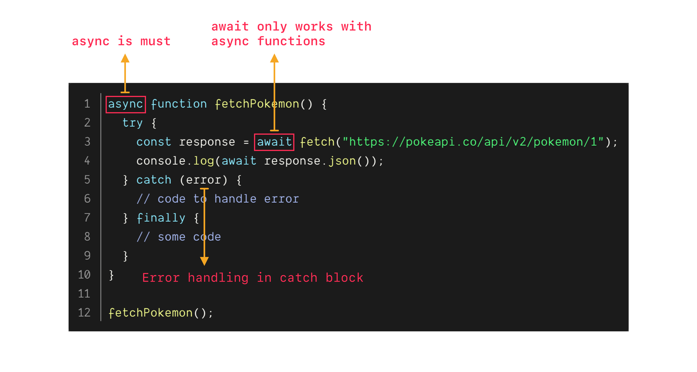

<br /><br />

Before async await, we used **promises** and **callbacks** to handle the **asynchronous code** in javascript. While working with **promises** and **callbacks** you might have heard a term called **callback hell**. In simple terms, it happens when our code has too many nested **callbacks**.

To solve the callback hell, a new feature was introduced in **ECMAScript 8** (2017) called `async await`. Async await is a new way to write **asynchronous code** in **javascript**.

So what is async await and how does it work?

#### 1. async

To create an `async` function, **async** keyword should be added in front of **function** keyword.

**Few points to remember:**

- When an `async` function is called, it returns a **promise**. If the returned value is not a promise, then `async` will **wrap it in promise** and **return it**.
- **Throwing an exception** in async function is equal to **rejecting** a promise.

**Example**:

```js{numberLines: true}{1,7-8}
async function sayHello(say) {
  return "hello";
}

// To handle success & failure
sayHello()
  .then(console.log) // success
  .catch(console.log); // failure
```

#### 2. await

`await` keyword can only be used inside `async` function, except for the [top-level await](https://v8.dev/features/top-level-await).

**Few points to remember:**

- `await` keyword allow us to wait **synchronously** on an **asynchronous code**.
- Can be used with **try/catch** statement to handle success and failure.
- **Less boilerplate** code compared to promise with callbacks.

**Example**:

```js{numberLines: true}{1,3-4,6-7,10-12}
async function fetchPokemon() {
  try {
    const pokemon1 = await fetch("https://pokeapi.co/api/v2/pokemon/1");
    const pokemon2 = await fetch("https://pokeapi.co/api/v2/pokemon/2");

    const response1 = await pokemon1.json();
    const response2 = await pokemon2.json();

    console.log(response1.name + " " + response2.name);
  } catch (error) {
    console.log(error);
  }
}

fetchPokemon(); // logs "bulbasaur ivysaur"
```

Async await works as if the code were **synchronous**, but **without blocking** the main thread. Read my previous post to understand more about main thread and [event loop](/posts/event-loop).

Let's see the same example using promise based [fetch](https://developer.mozilla.org/en-US/docs/Web/API/Fetch_API) API.

**Example**:

```js{numberLines: true}{3-15,17-19}
function fetchPokemon() {
  fetch("https://pokeapi.co/api/v2/pokemon/1")
    .then(response1 => {
      return response1.json().then(response1 => {
        return fetch("https://pokeapi.co/api/v2/pokemon/2").then(response2 => {
          return response2
            .json()
            .then(response2 => {
              console.log(response1.name + " " + response2.name);
            })
            .catch(error => {
              console.log(error);
            });
        });
      });
    })
    .catch(error => {
      console.log(error);
    });
}

// Fetch pokemon
fetchPokemon(); // logs "bulbasaur ivysaur"
```

The above code works as expected but it is **hard to debug** and becomes a **non-maintainable code** if we want to modify or extend the function.

**Below gif explains async await in 7 seconds**:

https://twitter.com/manekinekko/status/855824609299636230

Some **disadvantages** of async await.

**Disadvantages**:

- We cannot do **multiple await** in the same line. There no way to run **multiple async** operations **simultaneously**. But the same can be done in normal promises using `promise.all()`.
- If we are supporting old browsers then [babel](https://babeljs.io/) will transpile and **bloat** the [code](https://babeljs.io/repl#?browsers=&build=&builtIns=false&spec=false&loose=false&code_lz=IYZwngdgxgBAZgV2gFwJYHsLwKbKgCwAV0BrbAW0wAoBKGAbwCgYZkAnMB5lmKTEZDAAOpCphgBeGMADuwVILi4CVAET5kyISABcAej0iywIagB0fPSdR6AbgCZDoyhD0BGVTQDc3Fnwgg6AA22GZB6ADmVLLygkZiEGYAVoEQtN7cAL68wHj4MFTYbGzobHRMPLz8waHhUUUlZT4smYytjEp5xGQutF4wBjB1IDCqAEYIQWOgwAhsqoxAA&debug=false&forceAllTransforms=false&shippedProposals=true&circleciRepo=&evaluate=true&fileSize=true&timeTravel=false&sourceType=script&lineWrap=true&presets=env%2Cenv&prettier=true&targets=&version=7.9.6&externalPlugins=).

**Fun fact:**

<blockquote> Async await is a syntactic sugar built on top of promises.</blockquote>

If you know javascript well then you might have already guessed that `await` calls `then()` method under the hood. Now you know why **await only works with async** functions.

**Example:**

```js{numberLines: true}{3-5}
var customThenFunz = () => {
  return {
    then: (resolve, reject) => {
      resolve("hello"); // resolve & reject are promise callback's
    },
  };
};

console.log(await customThenFunz()); // logs "hello"
```

In the above example, await calls the `then()` method returned by the **customThenFunz** function. One more point to remember is `async await` uses [generators](https://developer.mozilla.org/en-US/docs/Web/JavaScript/Reference/Statements/function*) internally to **pause** and **resume** execution of the code.

Same examples using **generators & promises** to understand how async await would be been implemented internally.

Before I proceed with implementation, let's try to understand the basics of [generators](https://developer.mozilla.org/en-US/docs/Web/JavaScript/Reference/Statements/function*).

- To create a generator function, `function` keyword should have a `*` (asterisk symbol) following it.
- A generator function returns a **generator object**.
- A generator object follows the [iterable protocol](https://developer.mozilla.org/en-US/docs/Web/JavaScript/Reference/Iteration_protocols).
- `yield` keyword is used to **pause** and **un-pause** the code.
- `next()` method in a way to tell to go to **next iteration**.
- Upon calling `next()` method, it returns a object with `value` and status called `done` (true or false).
- `throw()` method in generator object **resumes execution** by **throwing an error** and returns an object with `value` and `done`.

**Example:**

A simple counter function to return the count until maxCount is reached.

```js{numberLines: true}{1,4,10-12}
function* counter(maxCount) {
  var i = 1;
  while (i <= maxCount) {
    yield i++;
  }
}

var iterator = counter(2);

console.log(iterator.next()); // logs {value: 1, done: false}
console.log(iterator.next()); // logs {value: 2, done: false}
console.log(iterator.next()); // logs {value: undefined, done: true}
```

Now we understood how generator in javascript works, lets write our custom async await function.

**To emulate async await we need to do the following:**

- Should be able to **synchronously** wait **without blocking** the main thread.
- Should be able to **halt** and **resume** the execution.
- Should be able to **return the value** once done. (Eg: fetch api or just a number or promise based object)
- Should **throw an error** If it **fails**.

We will name our custom function as `customAsyncAwait`. Input for `customAsyncAwait` function will be **generator** function. Inside our customAsyncAwait function, we will create a **generator object** by calling the **input** when our **customAsyncAwait** invoked. A function called `resolver()` is used to handle **iteration** of the generator which will be called recursively by passing **iterator object** as an **input**. If the iteration is **done**, then **resolve** and **return** the value. If it **fails** throw an error which in turn **resolves** and **return** the error.

```js{numberLines: true}{3,8,10-12,16,20,31,22-23,25-26,29-31}
function customAsyncAwait(generatorFunz) {
  // create generator object
  const generatorObj = generatorFunz();

  function resolver(currentIteration) {
    // If the iterator object is done then return the value
    if (currentIteration.done) {
      return Promise.resolve(currentIteration.value);
    } else {
      return Promise.resolve(currentIteration.value)
        .then(value => resolver(generatorObj.next(value))) // proceed with next iteration in generator
        .catch(error => resolver(generatorObj.throw(error))); // throw an error
    }
  }

  return resolver(generatorObj.next()); // Start the iteration
}

// Fetch based generator
function* fetchPokemonGenerator() {
  try {
    const pokemon1 = yield fetch("https://pokeapi.co/api/v2/pokemon/1");
    const pokemon2 = yield fetch("https://pokeapi.co/api/v2/pokemon/2");

    const response1 = yield pokemon1.json();
    const response2 = yield pokemon2.json();

    console.log(response1.name + " " + response2.name);
  } catch (error) {
    console.log(error);
  }
}

// Call our custom async function
customAsyncAwait(fetchPokemonGenerator); // logs "bulbasaur ivysaur"
```

### [Demo](https://codesandbox.io/embed/custom-async-await-using-generators-ugl7z?expanddevtools=1&fontsize=14&hidenavigation=1&module=%2Fsrc%2Findex.js&theme=dark)

<iframe
  src="https://codesandbox.io/embed/custom-async-await-using-generators-ugl7z?expanddevtools=1&fontsize=14&hidenavigation=1&module=%2Fsrc%2Findex.js&theme=dark"
  style="width:100%; height:500px; border:0; border-radius: 4px; overflow:hidden;"
  title="custom async await using generators"
  allow="accelerometer; ambient-light-sensor; camera; encrypted-media; geolocation; gyroscope; hid; microphone; midi; payment; usb; vr"
  sandbox="allow-forms allow-modals allow-popups allow-presentation allow-same-origin allow-scripts"
></iframe>

#### Final thoughts

Async await is an interesting topic and powerful feature in javascript. It helps us to write the asynchronous code more readable and maintainable. I hope in this post you have learned a little bit more about javascript. The custom async await function I wrote might not be how async await would have been implemented but you get the idea right how it works?.

Post a comment below or reply to my newsletter if you have any questions. If you like the post share it.

Thanks for reading till the end :)

Follow me on [twitter](https://twitter.com/gokul_i) for more web related things.

#### References:

- [async await specification](https://tc39.es/ecma262/#sec-async-function-definitions)
- [async await](https://developer.mozilla.org/en-US/docs/Learn/JavaScript/Asynchronous/Async_await)
