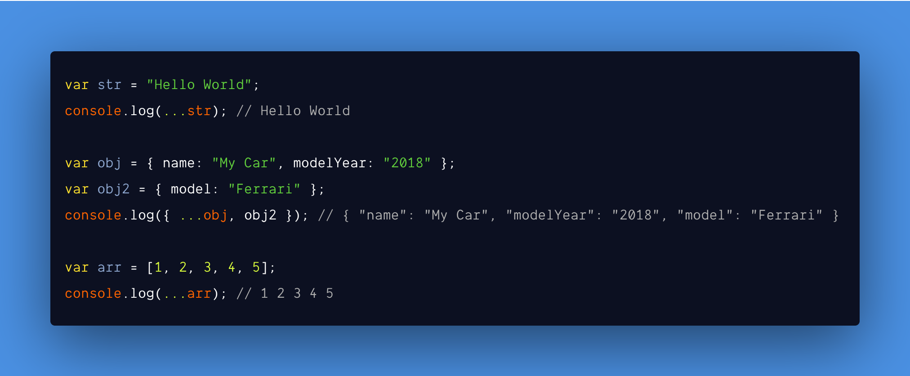

<br /><br />

In javascript, [spread operator](https://developer.mozilla.org/en-US/docs/Web/JavaScript/Reference/Operators/Spread_syntax) is denoted by **…** (3 dots), basically it takes an array or object or string and can **copy or expand or concat or merge** its items to another variable.

And we will not be looking into [rest parameters](https://developer.mozilla.org/en-US/docs/Web/JavaScript/Reference/Operators/Spread_syntax#Rest_syntax_parameters) which looks similar to spread operator but used for destructuring array and objects.

#### Example:

```js
var str = "Hello World";
console.log(...str); // H e l l o   W o r l d

var obj = { name: "My Car", modelYear: "2018" };
var obj2 = { model: "Ferrari" };
console.log({ ...obj, obj2 }); // { "name": "My Car", "modelYear": "2018", "model": "Ferrari" }

var arr = [1, 2, 3, 4, 5];
console.log(...arr); // 1 2 3 4 5
```

First, we will see its **pros** and **cons** and how it works then we will implement it.

Let us start with the cons.

#### Cons:

- It can be used for copying but **only up to one level deep**. So it is **not suitable** for **multidimensional arrays and deep level objects**.
- It can spread only **enumerable** properties of an **Object**.
- It can only be applied to [iterable](https://developer.mozilla.org/en-US/docs/Web/JavaScript/Reference/Global_Objects/Symbol/iterator) objects.
- It will work on both **Array** and **Object** data types but you **cannot mix and match** them.

#### Pros:

- It can be used for shallow cloning an object if we want to copy only that object's own properties.
- **Cleaner syntax** and **less code** when merging or copying.
- Can be used with a function or a **Math** method without the need for **.apply()** method to pass multiple parameters.
- It can be used to **convert an array like object** into an **actual array**. (**Eg: NodeList from DOM**)

Now we have an idea of what spread operator is and what it can and can't do.

Let's implement our custom spread operator step by step.

**Example: custom spread operator [...5]**

```js
// This is how our Custom Spread Operator will look like
console.log([...5]); // [1, 2, 3, 4, 5]

// Above custom spread operator will not work now and
// We will get the following error
// Uncaught TypeError: number 5 is not iterable (cannot read property Symbol(Symbol.iterator))
```

#### Step 1:

- We will use [Symbol.iterator](https://developer.mozilla.org/en-US/docs/Web/JavaScript/Reference/Global_Objects/Symbol/iterator) to write our custom spread operator.

#### What is Symbol.iterator?

1. **Symbol.iterator** let us to create a **custom iterator** function (not possible before ES6).
1. It uses **iterator protocol** which defines a **standard way** to produce a **sequence of values** which is either **finite** or **in-finite** and return those values **when all values** are done or generated.
1. Iterable **data sources** are **Array**, **Sets**, **Maps**, **Objects**, **arguments** and **DOM data structures** (Eg: **NodeList**) etc,.

**Symbol.iterator** contains two parts.

1. An object whose key is **Symbol.iterator** called `Iterable`.
1. A function for the above key called `Iterator` to iterate the values passed to it.

**Example**:

```js
var myCustomIterator = {
  [Symbol.iterator]: function() {},
};
```

Simple right? 😆

In the below example, we will create a simple **iterable function** to understand more.

**👉🏻 Note:** By default functions are **not iterable**.

```js
// A simple function which will accept a parameter called `n`
// and it return myCustomIterator.

var generateNumbers = function(n) {
  var myCustomIterator = {
    [Symbol.iterator]: function() {
      var i = 1; // Statement 1
      return {
        next: () => {
          return {
            value: i++, // Statement 3
            done: i === n + 2, // Statement 2
          };
        },
      };
    },
  };

  return myCustomIterator;
};

generateNumbers(); // return an iterable function
```

Explanation for above code:

- `generateNumbers()` function upon calling it return an object.
- Returned object contains a method called `next()` and it in turn return an **object** with two properties called **value** & **done**.
- Method `next()` will be called on **each iteration**.
- Think of `value` property as **third statement** in for loop (Eg: **for (statement 1; statement 2; i++)**).
- Think of `done` property as **second statement** in for loop (Eg: **for (statement 1; i === n + 2; i++)**)
- So we will increment initial value **i** from **1** to **n**.

To make sure our `generateNumbers()` is iterable we will use **for of** and **spread operator** loop in below example:

```js
for (var i of generateNumbers(5)) {
  console.log(i); // prints from 1 to 5
}

// It works 😆

// Now we can do this
[...generateNumbers(5)]; // prints from 1 to 5

// TADA 😁
```

Cool right? We made a function **iterable**.

In our next and final step, we will make **generateNumbers()** as a native feature so that we can do this `[...5]` instead of `[...generateNumbers(5)]`.

#### Example:

```js
// Add Symbol.iterator to Number prototype
Number.prototype[Symbol.iterator] = function() {
  var i = 1; // Statement 1
  return {
    next: () => {
      return {
        value: i++, // Statement 3
        done: i === this + 2, // Statement 2
      };
    },
  };
};

// Now I can do this 🤪
console.log([...5]); // [1, 2, 3, 4, 5]
```

### Final thoughts

Thanks to [TC39](https://tc39.es/) committee and [ES6](https://github.com/tc39/proposals) specs, we were able to write our own **custom iterator function** with **spread operator**. Would love to know how you are going to use **Symbol.iterator** now that you have learned about it.

If you liked it **tweet** about it. Hoping you learned something new about javascript today.

My next post is **how a virtual DOM works**. And if you are not subscribed, subscribe below :D

<hr />

#### References:

- [MDN](https://developer.mozilla.org/en-US/docs/Web/JavaScript/Reference/Operators/Spread_syntax)
- [Spread operator TC39 specification](https://tc39.es/proposal-object-rest-spread/)
- [Iterables and iterators](https://exploringjs.com/es6/ch_iteration.html#ch_iteration)
