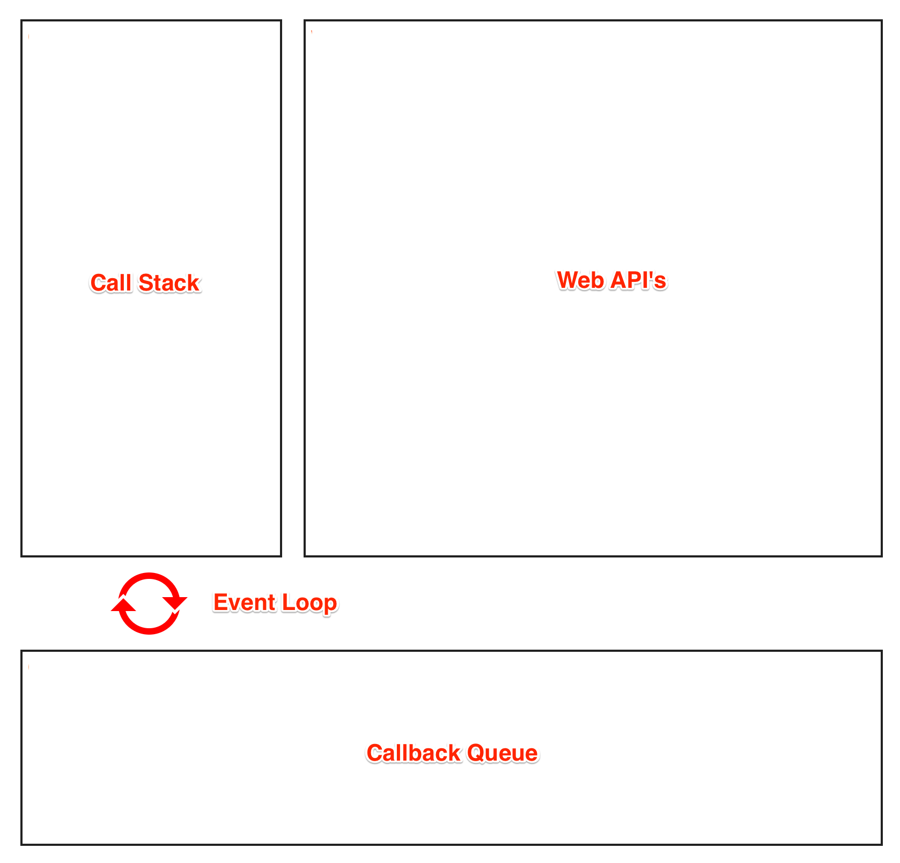

Javascript runtime is **single threaded** meaning it can **execute one piece of code at a time**. In order to not to block I/O operations, javascript has concurrent model called **Event loop**.

All `I/O` operations such as **HTTP requests**, **disk read/write** etc are **non-blocking** in javascript. The single thread will ask the **javascript runtime** to execute the operation providing a callback function and move on to next operation.

#### Javascript runtime consists of:

- **Call stack** - To execute the code one at a time.
- **Web API's** - Talk to browser via javascript.
- **Callback queue** - Callbacks are pushed into the callback queue.
- **Event loop** - Check if call stack is empty if empty take the callback from callback queue and add it to stack.

**Illustration of javascript runtime**:


<i class="image__illustration">(Illustration of js runtime)</i>

### Call Stack

Call stack in javascript can do **one only thing at time**. Call stack is simple **stack** based **data structure** which executes the code by **pushing code** on top of the stack and **popping it off** from the top once execution is done.

**Example**:

```js{numberLines: true}{2,6,8,11,13}
function foo() {
  console.log("foo");
}

function baz() {
  foo();

  console.log("baz");
}

console.log("outside");

baz();
```

**Output**:

```js
// 1. print outside
// 2. print foo
// 3. print baz
```

**Explanation:**

1. Add `console.log('outside')` to **top** of the stack and **execute** and **pop it off**.
1. Add `baz()` function call to **top** of the stack and **execute** it.
1. Add `foo()` function call to **top** of the stack and **execute** it.
1. Add `console.log("foo")` to **top** of the stack and **execute** it and **pop it off**.
1. Then **pop** `foo()` function from the stack.
1. Add `console.log("baz")` to **top** of the stack and **execute** and **pop it off**.
1. Then **pop** `baz()` function from the stack.

### [Demo](http://latentflip.com/loupe/?code=ZnVuY3Rpb24gZm9vKCkgewogIHNldFRpbWVvdXQoZnVuY3Rpb24gdGltZW91dENhbGxiYWNrKCkgewogICAgY29uc29sZS5sb2coImZvbyIpOwogIH0sIDEwMDApOwp9CgpmdW5jdGlvbiBiYXooKSB7CiAgZm9vKCk7CiAgY29uc29sZS5sb2coImJheiIpOwp9Cgpjb25zb2xlLmxvZygib3V0c2lkZSIpOwoKYmF6KCk7!!!PGJ1dHRvbj5DbGljayBtZSE8L2J1dHRvbj4%3D)

Wait a minute, if the call stack can **execute only one thing at a time** will it **not block the main thread**?. Not really, we will see more about it later in the post.

### Web API's

Web API's also known as **Browser Object Model** (BOM) are the api's that allows javascript **to talk** to **web browsers**.

**Some of API's are**

- Window object
- Window location
- Navigator (information about user's browser)
- Cookies
- Timing Events such as setTimeout, setInterval etc,

Lets see an example of how web api works in event loop. If you are javascript developer i am sure you would have used setTimeout or setInterval.
So lets take that as an example.

```js{numberLines: true}{8,2-4}
function foo() {
  setTimeout(function() {
    console.log("foo");
  }, 2000);
}

foo();
```

I am sure you already know about execution order if not no problem, I will explain below.

**Explanation:**

1. Add `foo()` to **top** of the stack and **execute** it.
1. Add `setTimeout()` with callback to **top** of the stack and **execute** it and pop it off.
1. Add setTimeout `callback` to **callback queue**.
1. `Timer` function will be executed inside the browser.
1. Event loop has one job which is to `pull callbacks from queue` and `put into stack` when `stack is empty`.
1. Add `console.log()` to stack and execute it and **pop it off**.
1. Finally pop function `foo()` from the stack.

<video controls>
  <source src="./web-apis.mp4" type="video/mp4">
</video>

### [Demo](http://latentflip.com/loupe/?code=ZnVuY3Rpb24gZm9vKCkgewogIHNldFRpbWVvdXQoZnVuY3Rpb24oKSB7CiAgICBjb25zb2xlLmxvZygiZm9vIik7CiAgfSwgMjAwMCk7Cn0KCmZvbygpOw%3D%3D!!!PGJ1dHRvbj5DbGljayBtZSE8L2J1dHRvbj4%3D)

#### Final note

It was refreshing when I wrote this post. I hope in this post you have learned little bit more about javascript and its runtime.

The examples I showed are more of an abstract idea of event loop and browser vendors would have implemented the event loop with lot of optimizations but now you get idea right how it works.

I want to thank to [Philip Roberts](https://twitter.com/philip_roberts) for creating [loupe](http://latentflip.com/loupe) an awesome tool to visualize how event loops works. Do watch his video about [what the heck is event loop](https://www.youtube.com/watch?v=8aGhZQkoFbQ) its great.

Thanks for reading it so far. See yaa in next post.
