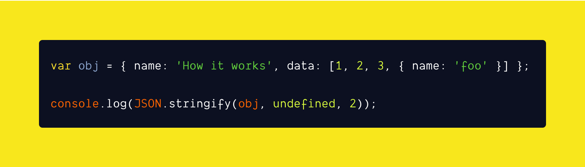

<br /><br />

`stringify()` is a method in **JSON** object converts a value (Eg: Object, Number, Array etc) to a string in **UTF-16** encoded JSON format. Few use cases are converting data to string when sending to the server via **fetch** or storing the data in **localStorage** by converting it to string etc.

**JSON.stringify()** accepts 3 parameters:

- **Value** - Could be a Object, Array, Boolean, Null, Undefined, String, Symbol.
- **Replacer** or **Inclusion** function (optional) - To alter or include a value.
- **Space** (optional) - To insert space to make it readable (Eg: 2 or "4").

**Points to remember:**

- If the object contains `toJSON` key with value as a function (a method), then value **returned by the method** will be used and serialized instead of the values of the object.
- Also **we cannot serialize** an object which has **circular reference**. A **type error** will be thrown by the javascript engine.

Let's see an example of how JSON.stringify() method works.

**Example:**

```js{numberLines: true}{30-32,37,40,43}
var myObj = {
  random: 73,
  "random float": 93.655,
  isAlive: true,
  date: "1987-03-11",
  firstname: "Myrtice",
  lastname: "Rosalba",
  city: "Amritsar",
  countryCode: "MP",
  nullValue: null,
  array: ["Georgina", "Lolita", "Shandie", "Deirdre", "Lynea"],
  "array of objects": [
    {
      index: 0,
      "index start at 5": 5,
    },
    {
      index: 1,
      "index start at 5": 6,
    },
    {
      index: 2,
      "index start at 5": 7,
    },
  ],
};

// String replacer function
function stringReplacer(key, value) {
  if (typeof value === "string") {
    return undefined;
  }

  return value;
}

// Logs formatted json object
console.log(JSON.stringify(myObj));

// Logs only formatted number, boolean, null value in json object
console.log(JSON.stringify(myObj, stringReplacer));

// Logs formatted 2 spaced json object
console.log(JSON.stringify(myObj, undefined, 2));
```

Now that we have seen what is the output of **JSON.stringify()** method and how it works, lets implement it step by step.

### 1. Serializing values

For starters, we will start with the following **data types**.

- undefined
- number
- boolean
- string

```js{numberLines: true}{3,6,10,14}
function stringify(value) {
  // Type of the value argument
  var type = typeof value;

  function getValues(value) {
    if (type === "undefined") {
      return undefined;
    }

    if (type === "number" || type === "boolean") {
      return "" + value + "";
    }

    if (type === "string") {
      return '"' + value + '"';
    }
  }

  return getValues(value);
}

console.log(stringify(1)); // "1"

console.log(stringify("abc")); // ""abc""

console.log(stringify(true)); // "true"

// Just undefined instead of "undefined"
console.log(stringify(undefined) === JSON.stringify(undefined)); // true
```

The above function so far is self-explanatory. All it does is wrap the values with quotes and return it expect for the `undefined` data type.

Now we will add support for more data types like

- array
- object
- null
- date
- functions (methods)

To support **array** and **object**, we should be able to parse the value up to `n level`. So n level means `recursion` would be a preferable choice. We have to recursively go up the children and serialize the values. Also one interesting thing I noticed is for **date object** is, JSON.stringify() method returns the value in `ISO format`.

```js{numberLines: true}{20,22,27-29,32-33,37-43}
function stringify(value) {
  var type = typeof value;

  function getValues(value) {
    if (type === "undefined" || type === "function") {
      return undefined;
    }

    if (type === "number" || type === "boolean") {
      return "" + value + "";
    }

    if (type === "string") {
      return '"' + value + '"';
    }
  }

  // For object datatype
  // In javascript both array and object are objects (FYI if you didn't know already)
  if (type === "object") {
    // To check if the value is null
    if (!value) {
      return "" + value + "";
    }

    // To check if the value is date object
    if (value instanceof Date) {
      return '"' + new Date(value).toISOString() + '"'; // return ISO format
    }

    // To check if the value is Array
    if (value instanceof Array) {
      return "[" + value.map(stringify) + "]"; // Call stringify recursively to return its value
    } else {
      // Else it is just an object
      // Call stringify recursively to map key and its value
      return (
        "{" +
        Object.keys(value).map(
          key => '"' + key + '"' + ":" + stringify(value[key])
        ) +
        "}"
      );
    }
  }

  return getValues(value);
}

console.log(stringify([1, 2, 3])); // "[1,2,3]"

console.log(stringify(new Date())); // prints date in ISO format

console.log(stringify({ a: 1 })); // ""{a:1}""

console.log(stringify(myObj) === JSON.stringify(myObj)); // true

console.log(JSON.parse(stringify(myObj))); // Same as JSON.parse(JSON.stringify(myObj))
```

The above function now works for all data types and also the output is same as the JSON.stringify() method.

Now lets add support for `toJSON()` method. Just to re-iterate, if an object contains **toJSON** method and whatever it is returning will be used by JSON.stringify().

```js{numberLines: true}{6-8}
var myObj = { toJSON: () => "a" };

function stringify(value) {
  function getValues(value) {
    // To check if object has `toJSON` method or not
    if (typeof value.toJSON === "function") {
      return '"' + value.toJSON() + '"';
    }
  }

  return getValues(value);
}

console.log(stringify(myObj)); // ""a""
console.log(stringify(myObj) === JSON.stringify(myObj)); // true
```

For the sake of this post we will ignore adding support of `Symbol` datatype, the `replacer` function, and `space` argument. I will leave it up to you to add support for it. Once done share it with me.

### Demo:

<iframe
     src="https://codesandbox.io/embed/custom-jsonstrigify-cuzoh?expanddevtools=1&fontsize=14&hidenavigation=1&previewwindow=tests&theme=dark"
     style="width:100%; height:500px; border:0; border-radius: 4px; overflow:hidden;"
     title="custom JSON.strigify()"
     allow="accelerometer; ambient-light-sensor; camera; encrypted-media; geolocation; gyroscope; hid; microphone; midi; payment; usb; vr; xr-spatial-tracking"
     sandbox="allow-forms allow-modals allow-popups allow-presentation allow-same-origin allow-scripts"
   ></iframe>

### Final thoughts

JSON.stringify() method is powerful feature in javascript. Implementing JSON.stringify() was a bit tricky even though the implementation seems simple. I have learned more about JSON.stringify() method now than before.

Hoping you have learned something new today about javascript as well. Post your comments below if you have any questions. If you like the post share it.

[Follow me](https://twitter.com/gokul_i) on twitter for more web related things. See ya in next post ;)

#### References

- [JSON.stringify](https://developer.mozilla.org/en-US/docs/Web/JavaScript/Reference/Global_Objects/JSON/stringify)
- [JSON.stringify specification](https://tc39.es/ecma262/#sec-json.stringify)
