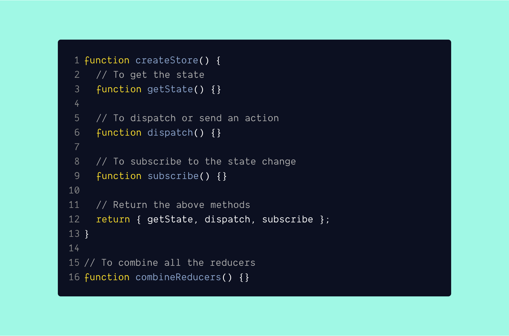

<br /><br />

Redux is a predictable state container for javascript applications. In layman's term, We store our data in a centralized place and pass it where ever needed by the application.

### 👉🏻 Few points about redux:

- **Single source of truth** - A plain single object to store your application data.
- **Predictable** - Behaves consistently no matter the environments (client, server and native).
- **Developer Friendly** - With redux devTools it is easy to debug and test our application.
- **Flexible** - Works with any UI layered application.

**Below are the core concept of redux**:

- `Store` - A centralized data store (**Read only, Plan object**).
- `Action` - An information about the change (type) and an optionally payload data.
- `Reducer` - A pure function to decide what to do with the action type and payload.

### Skeleton code: `redux.js`

```js{numberLines: true}{3,6,9,16}
function createStore() {
  // To get the state
  function getState() {}

  // To dispatch or send an action
  function dispatch() {}

  // To subscribe to the state change
  function subscribe() {}

  // Return the above methods
  return { getState, dispatch, subscribe };
}

// To combine all the reducers
function combineReducers() {}
```

#### 1. createStore()

To create our data store of the application. The main concept of redux is we can have only one store. [createStore()](https://redux.js.org/api/createstore) method accepts [three arguments](https://redux.js.org/api/createstore#arguments).

1. Reducer (Root reducer)
1. Preloaded state (initial state - `optional`)
1. Enhancer (`optional`) - Just to reduce the scope of this post we will not look into this.

createStore function will return 3 methods (`getState`, `dispatch`, `subscribe`). Now we will see all three one by one.

#### 1. getState()

Returns the latest updated state from the redux store.

**Code:**

```js{3, 6-8}{numberLines: true}
function createStore(reducer, preloadedState, enhancers) {
  // If preloaded state else empty object
  let state = preloadedState || {};

  // Return the store state
  function getState() {
    return state;
  }

  return {
    getState,
  };
}
```

#### 2. subscribe()

This method is useful when we want to **listen to** whenever the store **state is updated**. **subscribe()** also returns `unsubscribe()` method so that we can opt-out when we no longer need it.

**Code:**

```js{numberLines: true}{6,14-21}
function createStore(reducer, preloadedState = {}, enhancers) {
  // If preloaded state else empty object
  let state = preloadedState || {};

  // To store the list of subscribers for the state change
  let listeners = [];

  // Return the store state
  function getState() {
    return state;
  }

  // To subscribe to state change
  function subscribe(listener) {
    listeners.push(listener);

    // Returns an anonymous function to unsubscribe
    return function() {
      listeners = listeners.filter(l => l != listener);
    };
  }

  return { getState, subscribe };
}
```

#### 3. dispatch()

Dispatches an action that **contains information** about the change. The information is **plan object** which contains **type** and **payload** if required.
This is the only way to update the state in the redux store.

**Dispatch method does 2 things:**

1. Update the state using the type in the `reducer` passed to `createStore()` when we created the store.
1. Calls all the subscribers if present after the state has updated.

**Code:**

```js{numberLines: true}{23-27,30}
function createStore(reducer, preloadedState = {}, enhancers) {
  // If preloaded state else empty object
  let state = preloadedState || {};

  // To store the list of subscribers for the state change
  let listeners = [];

  // Return the store state
  function getState() {
    return state;
  }

  // To subscribe to state change
  function subscribe(listener) {
    listeners.push(listener);

    // Returns an anonymous function to unsubscribe
    return function() {
      listeners = listeners.filter(l => l !== listener);
    };
  }

  function dispatch(action) {
    state = reducer(state, action);

    listeners.forEach(listener => listener());
  }

  // To initializing the store with initial state of the reducers
  dispatch({ type: "@@redux/INIT" });

  return { getState, subscribe, dispatch };
}
```

#### 4. combinerReducers()

Combine reducers function is to **combine all reducers** and call it to update the state when an action is dispatched.

**combinerReducers function does the following**:

- Returns **a function** which accepts two arguments (**state & action**).
- Iterates over the reducers argument and passes the **appropriate state object** to **each reducer** with its **action**.
- Then updates **each store state** with **whatever the reducer returning**.

**Code:**

```js{numberLines: true}{2-7}
function combineReducers(reducers) {
  return (state = {}, action) => {
    return Object.keys(reducers).reduce((nextState, key) => {
      nextState[key] = reducers[key](state[key], action); // Calling the reducers
      return nextState;
    }, {});
  };
}
```

Now that we understood each method of redux library. Let us see an example of how our custom redux works.

### Example:

<iframe
     src="https://codesandbox.io/embed/reduxjs-m53j5?expanddevtools=1&fontsize=14&hidenavigation=1&theme=dark"
     style="width:100%; height:500px; border:0; border-radius: 4px; overflow:hidden;"
     title="redux.js"
     allow="geolocation; microphone; camera; midi; vr; accelerometer; gyroscope; payment; ambient-light-sensor; encrypted-media; usb"
     sandbox="allow-modals allow-forms allow-popups allow-scripts allow-same-origin"
   ></iframe>

### Final thoughts

I have learned so much about redux by writing this post and I hope you have learned something new as well. The code I wrote is just to show how redux would have been implemented. And this code is only for learning purposes. Not meant to be used in production or development.

Thanks for reading to the end. If you have any doubts post your comments below. See ya in the next post.

#### References

- [Flux](https://github.com/facebook/flux)
- [Redux](https://redux.js.org/introduction/getting-started)
- [React Redux](https://react-redux.js.org/)
