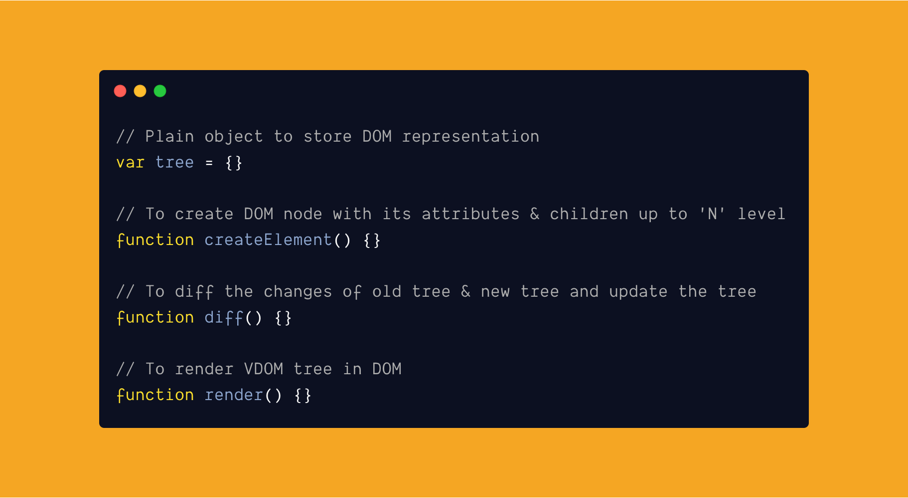

<br /><br />

### What is Virtual DOM?

Virtual DOM otherwise known as **VDOM**, is a **virtual representation** of actual [DOM](https://www.w3.org/TR/2004/REC-DOM-Level-3-Core-20040407/introduction.html) (Document Object Model) in the browser. VDOM is kept in **memory** and **synced** with actual DOM.

Before getting into coding, let's see some advantages and disadvantages.

**Advantages:**

- VDOM is useful when we want to **update the DOM** with **minimal operations**.
- Provides **great performance** over actual DOM when **accessing** and **updating** nodes **frequently**.

**Dis-Advantages:**

- Have to **keep track of changes** happening throughout the application.
- Takes **more memory** if not **efficiently** handled.

**👉🏻Note**: [Shadow DOM](https://developer.mozilla.org/en-US/docs/Web/Web_Components/Using_shadow_DOM) and [Virtual DOM](https://reactjs.org/docs/faq-internals.html) are not the same.

#### Popular Libraries using VDOM:

- [ReactJS](https://reactjs.org/)
- [PreactJS](https://reactjs.org/)
- [VueJS](https://vuejs.org/)

We will not look into any of the above libraries and their **VDOM implementations**. This post is about how a virtual DOM works (**More of a simplified version**).

First lets see an example of HTML representation.

#### Example: index.html

```html
<div class="container">
  <h1>Home</h1>
</div>
```

#### Representation of above HTML: DOM & VDOM

**DOM**:

```js
├── DIV.container
 ├── H1
 ├── #Home
```

**VDOM**: Plain object

```js
const VDOMTree = {
  type: "div",
  attributes: { className: "container" },
  children: [
    {
      type: "h1",
      attributes: {},
      children: ["Home"],
    },
  ],
};
```

**Functionality** of a virtual DOM is

1.  An **object** to store the representation of actual DOM.
1.  **create** element tree.
1.  **diff** the changes of new & old VDOM trees.
1.  **render** the VDOM tree in DOM.

**Code**: skeleton of **VDOM.js** file

```js
// Plain object to store DOM representation
var tree = {};

// To create DOM node with its attributes & children up to 'N' level
function createElement() {}

// To diff the changes of old tree & new tree and update the tree
function diff() {}

// To render VDOM tree in DOM
function render() {}
```

#### Step 1: Create Element

Create element function will accept **3 parameters**.

1. **type** of a node.
1. **attributes** of a node.
1. **children** for node.

```js
function createElement(type, attributes, ...children) {
  return { type, attributes, children };
}

const tree = createElement(
  "ul",
  { className: "list" },
  createElement("li", {}, "my list 1"),
  createElement("li", {}, "my list 2")
);

console.log(tree); // Result is below

/*
{
  "type": "ul",
  "attributes": {
    "className": "list"
  },
  "children": [
    {
      "type": "li",
      "attributes": {},
      "children": [
        "my list 1"
      ]
    },
    {
      "type": "li",
      "attributes": {},
      "children": [
        "my list 2"
      ]
    }
  ]
}
*/
```

#### Step 2: Diff changes

To compare changes in VDOM, we need a **diffing algorithm**. For that, we will take basic principles of react [reconciliation](https://reactjs.org/docs/reconciliation.html) diffing algorithm.

React implements a heuristic O(n) algorithm based on the following assumptions.

**Algorithm:**

1. First **compare** the **two root elements** of **new** & **old** VDOM tree.
1. If the **root elements** are **different**, **ignore** the **old VDOM** tree and use the **new VDOM** tree.
1. When comparing the same **element types** in VDOM tree, **only update** whatever has **changed** (Eg: class or text, etc,).
1. Go up to `'N'` and repeat the steps `1 to 3`.

Breaking our **diff()** function in **three parts** for better understanding.

1. **Diff** the node **type**.
2. **Diff** the node **attributes**.
3. **Diff** the node **children**.

**Code:** diff, diffAttributes, diffChildren

```js
function diff(oldTree, newTree) {
  // If new tree is not present return empty array
  if (!newTree) {
    return [];
  }

  // Compare two root tree type
  if (oldTree.type !== newTree.type) {
    // if not equal ignore the old tree & return new tree
    return newTree;
  }

  // If old & new tree are equal return old tree
  if (oldTree === newTree) {
    return oldTree;
  }

  // If old & new tree is of type string, then it's a next node so return new tree
  if (typeof oldTree === "string" && typeof newTree === "string") {
    return newTree;
  }

  var updatedTree = { ...oldTree }; // To store our updated tree

  // If both tree types are equal, then start diffing attributes & its children
  if (oldTree.type === newTree.type) {
    // DIff attributes (props)
    var patchAttributes = diffAttributes(
      oldTree.attributes,
      newTree.attributes
    );

    // If there is diff in attributes then update it
    if (patchAttributes) {
      updatedTree.attributes = patchAttributes;
    }

    // Diff children of both trees
    var patchChildren = diffChildren(oldTree.children, newTree.children);

    // If there is diff in children element then update it
    if (patchChildren) {
      updatedTree.children = patchChildren;
    }
  }

  return updatedTree; // return the updated tree
}

// To compare old & new tree children
function diffChildren(oldTreeChildren, newTreeChildren) {
  var updatedChildren = []; // To store our updated children

  var oldTreeChildrenLength = oldTreeChildren.length;
  var newTreeChildrenLength = newTreeChildren.length;

  // Calculating length iterate the children
  var length =
    oldTreeChildrenLength > newTreeChildrenLength
      ? oldTreeChildrenLength
      : newTreeChildrenLength;

  // Iterate the children node tree
  for (var i = 0; i < length; i++) {
    var leftNode = oldTreeChildren[i];
    var rightNode = newTreeChildren[i];

    // If leftNode is not present & rightNode is present
    // That means new children is present in new tree children
    if (!leftNode) {
      if (rightNode) {
        updatedChildren.push(rightNode); // Add new children
      }
    }
    // Else recursively traverse the tree children and diff it
    // Up to 'N' of trees
    else {
      updatedChildren = updatedChildren.concat(diff(leftNode, rightNode));
    }
  }

  return updatedChildren; // return the updated children
}

// To compare old & new tree attributes
function diffAttributes(oldTreeAttrs, newTreeAttrs) {
  var updatedAttributes = {}; // To store attributes

  // If old tree attributes are not present return new tree attributes
  if (!oldTreeAttrs) {
    return newTreeAttrs;
  }

  // Start iterating tree attributes
  for (var oldTreeAttrKey in oldTreeAttrs) {
    // oldTree key is not in new tree attributes, remove it
    if (!(oldTreeAttrKey in newTreeAttrs)) {
      updatedAttributes[oldTreeAttrKey] = undefined;
    }

    var oldTreeAttrValue = oldTreeAttrs[oldTreeAttrKey]; // value of old tree attribute
    var newTreeAttrValue = newTreeAttrs[oldTreeAttrKey]; // value of new tree attribute

    // If value of old and new attributes are same continue the iteration
    // else update value of new tree attribute
    if (oldTreeAttrValue === newTreeAttrValue) {
      continue;
    } else {
      updatedAttributes[oldTreeAttrKey] = newTreeAttrValue;
    }
  }

  // Again start iterating new tree attributes to see if there any new attribute available
  // which is not present in old tree attributes
  for (var newTreeKey in newTreeAttrs) {
    // If new tree attribute is not present in old tree attributes
    // then add that attribute it
    if (!(newTreeKey in oldTreeAttrs)) {
      updatedAttributes[newTreeKey] = newTreeAttrs[newTreeKey];
    }
  }

  return updatedAttributes; // return updated attributes
}

// Example old tree
var oldTree = {
  type: "ul",
  attributes: { className: "list" },
  children: [
    { type: "li", children: ["My list 1"] },
    { type: "li", children: ["My list 2"] },
  ],
};

// Example new tree
var newTree = {
  type: "ul",
  attributes: { className: "list" },
  children: [
    {
      type: "li",
      attributes: { id: "my-list-2" }, // new
      children: ["My list 2"],
    },
    "simple text", // new
  ],
};

var updatedTree = diff(oldTree, newTree);

console.log(updatedTree); // Result is below

/*
{
  "type": "ul",
  "attributes": {},
  "children": [
    {
      "type": "li",
      "children": [
        "My list 2"
      ],
      "attributes": {
        "id": "my-list-2"
      }
    },
    "simple text"
  ]
}
*/
```

The above code is a little big, but I have commented on each and every line to understand better. So, I will skip explaining it.

#### Step 3: Render the VDOM tree in DOM

Job of the `render()` function is to **create/update/patch** the changes to **DOM elements** based on the **diff'ed tree** and render everything into DOM.

**Implementation details**:

- If **DOM element** is already present, use it else create a **DOM element**.
- **Diff** the **attributes** (props), if not present set the attributes else update it (Eg: **class** or **id**).
- **Diff** the **children nodes** by iterating **recursively** up to 'N' level.
- **Render** the DOM.

```js
function render(tree, renderTo) {
  // I am going to leave the function of render to you ;)
}

var tree = createElement(
  "ul",
  { className: "list" },
  createElement("li", {}, "my list 1"),
  createElement("li", {}, "my list 2")
);

render(tree, document.body); // render's the HTML in DOM
```

#### Summing up

I tried my best to explain **how a virtual DOM works**. The implementation might not be like **preact**, **react** would have implemented and theirs will be **far better** and **more performant** in nature. But you get the idea right. How a virtual DOM works?

For the sake of this post, I have left our lot of implementation, hope this post was helpful in understanding **little more** about **virtual dom**.

By the way [Jason Miller](https://github.com/developit), creator of **preact** has created a tiny **480Byte** [VDOM library](https://gist.github.com/developit/2038b141b31287faa663f410b6649a87). Check it out.

Thanks for reading it so far 😁. My next post will be about **Promise.allSettled()**. See you next Tuesday :)

<hr />

#### References:

- [How does the Virtual DOM work](https://codepen.io/sdras/full/RwwQapa) animation.
- [React VDOM](https://reactjs.org/docs/faq-internals.html).
- [Reconciliation](https://reactjs.org/docs/reconciliation.html).
- [Diff Algorithm](https://wiki.c2.com/?DiffAlgorithm).
